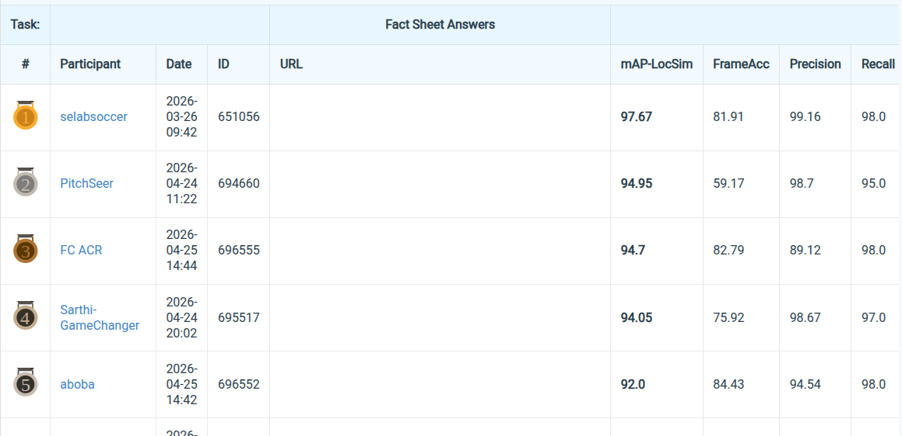

# PitchSeer: Single Frame World Coordinate Athlete Detection and Localization
with Synthetic Data (2nd place in SoccerNet challenge SynLoc challenge)

Top-down pose estimation pipeline for player localization on a football pitch.
The model predicts two keypoints per player — `body_anchor` (idx 0) and `ground_contact` (idx 1) —
and the `ground_contact` is then projected to 3D pitch coordinates via per-image camera matrices.
Evaluation uses **mAP-LocSim**, which scores localization in pitch units rather than image pixels.

This was our 2nd-place submission to the SoccerNet SpiideoSynLoc challenge.

## Leaderboard


## Repo layout

```
configs/
├── _base_/
│   ├── default_runtime.py
│   └── datasets/soccernet_4k.py        # 2-keypoint dataset schema
├── body/2d_kpt_sview_rgb_img/topdown_heatmap/soccernet/
│   ├── ViTPose_large_soccernet_4k_256x192.py             # Large heatmap-only
│   ├── ViTPose_large_3dloss_soccernet_4k_256x192.py      # Large + LocSim 3D loss (best)
│   ├── ViTPose_small_simple_soccernet_4k_256x192.py      # Small heatmap-only
│   ├── ViTPose_small_3dloss_soccernet_4k_256x192.py      # Small + LocSim 3D loss
│   ├── ViTPose_huge_soccernet_4k_256x192.py              # Huge from scratch
│   └── ...trainval-cosine variants
└── eval/                                                  # YAML configs for config-driven eval

scripts/
├── train/                                                 # training launchers (.sh / .sbatch)
├── eval/                                                  # evaluation launchers
└── monitor_log.sh                                         # tail latest slurm log

mmpose/                                                    # ViTPose's mmpose, with our additions:
├── models/losses/locsim_3d_loss.py                        # differentiable 3D Huber loss
├── models/detectors/top_down.py                           # optional loss_3d_keypoint / lambda_3d kwargs
└── datasets/datasets/top_down/topdown_soccernet_3d_dataset.py   # camera-aware dataset

mmcv_custom/                                               # LayerDecayOptimizerConstructor + apex runner
tools/                                                     # train/test/eval entry points
```

## Environment

Tested with Python 3.8, PyTorch 1.9.0+cu111, mmcv-full 1.3.9.

```bash
conda create -y -n vitpose python=3.8 pip
conda activate vitpose

pip install "torch==1.9.0+cu111" "torchvision==0.10.0+cu111" -f https://download.pytorch.org/whl/torch_stable.html
pip install "mmcv-full==1.3.9" -f https://download.openmmlab.com/mmcv/dist/cu111/torch1.9.0/index.html
pip install -r requirements.txt
pip install timm==0.4.9 einops "yapf==0.31.0" ultralytics==8.4.38 sskit
pip install -v -e .
```

Side note: Recommended to follow steps in UPSTREAM_README.md (of original ViTPose) to set up the environment followed by:
pip install timm==0.4.9 einops "yapf==0.31.0" ultralytics==8.4.38 sskit


## Dataset layout

Pick a directory for `DATA_ROOT` and organise it as follows:

```
DATA_ROOT/
├── images/
│   ├── train/
│   ├── val/
│   └── test/
└── annotations/
    ├── train.json     # COCO format (see conversion below)
    ├── val.json
    └── test.json
```

The raw SoccerNet SpiideoSynLoc 4K annotations are not in COCO format. Convert them once:

```bash
python tools/dataset/prepare_soccernet_4k.py \
  --ann-dir <where you unpacked raw 4K annotations> \
  --output-root <DATA_ROOT>/annotations
```

## Edit before running

Every script/config uses placeholders that you must replace. Each appears as a single editable variable at the top of its file — no scattered edits.

| Placeholder | Meaning | Used in |
|---|---|---|
| `DATA_ROOT` / `data_root` | dataset root (per layout above) | shell scripts in `scripts/`, configs in `configs/body/.../soccernet/` |
| `CHECKPOINT_DIR` / `checkpoint_dir` | directory holding trained ViTPose checkpoints (`.pth`) | shell scripts, 3D-loss configs |
| `PRETRAINED_DIR` / `pretrained_dir` | directory holding upstream ViTPose++ pretrained weights split via `tools/model_split.py` | Large heatmap and trainval-cosine configs |
| `DETECTOR_DIR` | directory holding YOLO / RT-DETR weights (`.pt`) | YOLO/RT-DETR eval scripts |
| `/path/to/repo` | absolute path to this repo | `configs/eval/*.yaml` (`repo_root:` and others) |

Each YAML config carries an `EDIT` comment block at the top listing every line that needs editing.

## Training

Edit `DATA_ROOT` and `CHECKPOINT_DIR` / `PRETRAINED_DIR` at the top of the script, then run:

```bash
# Small heatmap-only baseline
bash scripts/train/train_soccernet_4k.sbatch

# Large trainval-cosine (uses upstream ViTPose++ Large COCO pretrain)
bash scripts/train/train_soccernet_large_trainval_cosine.sh

# Small trainval-cosine
bash scripts/train/train_soccernet_trainval_cosine.sbatch
```

For the 3D-loss runs, point a training script at the corresponding 3D-loss config and a `CHECKPOINT_DIR` containing the heatmap-only initialisation (e.g. `vitpose_large_heatmap_epoch2.pth`).

For the detector branch we train a `yolo26m-pose` model end-to-end on pose estimation (see `scripts/train/train_yolo.py`, Ultralytics, requires a `data_det.yaml`). At inference time only its detector head is used — the predicted bounding boxes are passed to ViTPose for keypoint estimation. See the report for details.

## Evaluation

### Oracle (ground-truth boxes)

```bash
bash scripts/eval/eval_soccernet_oracle_locsim.sh
```

The `SPLIT="val"` variable in the script switches val/test.

### YOLO detection

```bash
bash scripts/eval/eval_soccernet_yolo_locsim.sh
```

Override the model on the fly:

```bash
CONFIG_PATH=configs/.../ViTPose_small_3dloss_soccernet_4k_256x192.py \
CHECKPOINT_PATH=${CHECKPOINT_DIR}/vitpose_small_3dloss_lambda1_epoch3.pth \
bash scripts/eval/eval_soccernet_yolo_locsim.sh
```

### Config-driven evaluation (RT-DETR, fixed-threshold)

Several flows are driven by YAML configs in `configs/eval/`. Edit the YAML first (each has an `EDIT` block at the top), then submit:

```bash
sbatch scripts/eval/eval_soccernet_oracle_test_fixed_threshold.sbatch
sbatch scripts/eval/eval_soccernet_rtdetr_locsim.sbatch
sbatch scripts/eval/eval_soccernet_rtdetr_test_fixed_threshold.sbatch
sbatch scripts/eval/eval_soccernet_yolo_test_fixed_threshold.sh
sbatch scripts/eval/eval_locsim_train10_fixed_threshold.sbatch
```

## Checkpoints

Trained checkpoints from the submission are available here: [**weights**](https://mbzuaiac-my.sharepoint.com/:f:/g/personal/mohamed_abouelhadid_mbzuai_ac_ae/IgB6MLalnMI8RL1QywD_nagPAW-NHY-Z23zcfj8L_m45dMM?e=ZN1OW5).

| Filename | Role | Oracle mAP-LocSim (val) |
|---|---|---:|
| `vitpose_large_heatmap_epoch2.pth` | Large heatmap-only (submitted for challenge) | 0.9421 |
| `vitpose_small_3dloss_lambda1_epoch3.pth` | Small + 3D loss | 0.9384 |
| `vitpose_small_baseline_epoch15.pth` | Small heatmap-only baseline | 0.917 |

Place all of them at `${CHECKPOINT_DIR}/` (the directory you assign in the scripts).

For the upstream **ViTPose++ pretrained weights** (used by `Large_soccernet_4k` and `large_trainval_cosine`):

1. Download the multi-task pretrained `.pth` from the upstream ViTPose repository.
2. Split it with `python tools/model_split.py --source <bundle>.pth --target <PRETRAINED_DIR>/` to produce per-task checkpoints (`coco.pth`, etc.).

More details can be found in the UPSTREAM_README.md (Original README.md of ViTPose)

For **YOLO detector weights**, place the `.pt` file at `${DETECTOR_DIR}/yolo_best.pt`.

## Method summary

The pipeline is top-down: a detector (YOLO, RT-DETR, or ground-truth oracle) supplies player bounding boxes, ViTPose then predicts the two keypoints per crop, and the `ground_contact` keypoint is back-projected to the pitch via the camera matrix attached to each image.

The 3D-loss variants add a differentiable Huber loss on the 3D pitch position, on top of the standard heatmap MSE loss. Because LocSim is non-linear in pixel error (small errors at the image edge → large pitch errors), optimising 3D distance directly yields a measurable improvement over heatmap-only training.

| Setting | Value |
|---|---|
| Input resolution | 256 × 192 |
| Pose head | TopdownHeatmapSimpleHead, 2 deconv layers, 64 × 48 heatmap |
| Backbone variants | ViT-Small (12 layers), ViT-Large (24 layers), ViT-Huge (32 layers) |
| Auxiliary 3D loss weight | λ = 0.5 (Large), λ = 1.0 (Small) |
| Optimiser | AdamW + LayerDecayOptimizerConstructor |
| Schedule | Step (heatmap) or CosineAnnealing (3D-loss / trainval) |

## Acknowledgments

This repo is built on top of [ViTPose](https://github.com/ViTAE-Transformer/ViTPose) (NeurIPS 2022 / TPAMI 2023). The upstream README is preserved at [`UPSTREAM_README.md`](UPSTREAM_README.md), and the upstream license is at [`LICENSE`](LICENSE).

If you use this code, please also cite the original ViTPose papers (citations in `UPSTREAM_README.md`).
